## 🔐 Web Application Attack & Defense Lab: DVWA on LAMP with WAF


## 📖 Overview

This is a step-by-step homelab project where I deployed, secured, and tested a vulnerable DVWA web application using a Web Application Firewall (SafeLine WAF).  
It covers full-stack configuration, simulated attacks (**SQLi, XSS,DoS,Cmd Injection, File Upload**, etc.), and defensive measures (WAF rules, **SSL, IP blocking, log analysis**).

---

## 🧰 Environment Setup

- **Virtualization:** VirtualBox
- **Networking Mode:** Bridged
- **Target VM:** Ubuntu 22.04 LTS (LAMP + DVWA)
- **Attacker VM:** Kali Linux
- **WAF:** SafeLine WAF (reverse proxy)
  
---

## 1️⃣ Installing and Configuring LAMP Stack

Install Apache2, PHP, and MySQL:
```bash
sudo apt update
sudo apt install apache2 mysql-server php libapache2-mod-php php-mysql
```

Secure the MySQL Installation:

```bash
sudo mysql_secure_installation
```

 ## 2️⃣ Installing and Configuring Damn Vulnerable Web App
(DVWA)

```bash
cd /var/www/html
sudo git clone https://github.com/digininja/DVWA.git
sudo chown -R www-data:www-data DVWA
```

Configure database in **config.inc.php**:
```bash
$_DVWA[ 'db_server' ]   = 'localhost';
$_DVWA[ 'db_database' ] = 'dvwa';
$_DVWA[ 'db_user' ]     = 'dvwa_user';
$_DVWA[ 'db_password' ] = 'p@ssw0rd';
```

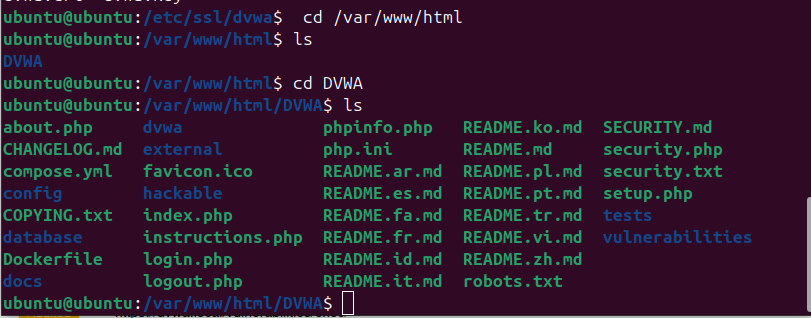


## 3️⃣ Setting up MySQL for DVWA

```bash
CREATE DATABASE dvwa;
CREATE USER 'dvwa_user'@'localhost' IDENTIFIED BY 'p@ssw0rd';
GRANT ALL ON dvwa.* TO 'dvwa_user'@'localhost';
FLUSH PRIVILEGES;
```

## 4️⃣ Changing the DVWA Listening Port to 8080
 
By default, Apache listens on port 80. To change it to 8080:

● Edit the Apache Configuration:

```bash
sudo nano /etc/apache2/ports.conf
```
Change:

Listen 80
=>
Listen 8080

● Update Virtual Host Configuration

Open the default virtual host file:

```bash
sudo nano /etc/apache2/sites-available/000-default.conf
```
Change <VirtualHost *:80> to <VirtualHost *:8080>.

● Restart Apache
```bash

sudo systemctl restart apache2
```
✅ DVWA is now accessible at:

```bash
http://<Ubuntu_IP>:8080/DVWA
```


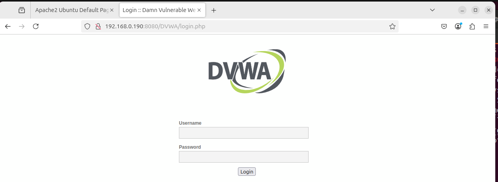


● **Initialize DVWA:**

Navigate to http://<Ubuntu IP>/DVWA/setup.php in your browser.
Click Create/Reset Database.

## 5️⃣ DNS Resolution Setup

 Using /etc/hosts for Local Resolution

```bash
sudo nano /etc/hosts
```
Add the following line at the end (replace <Ubuntu_IP> with the actual IP of your Ubuntu server):

```bash
<Ubuntu_IP> dvwa.local
```

## 6️⃣ Creating a Self-Signed SSL Certificate
To enable HTTPS on DVWA through the WAF, generate a self-signed SSL certificate on the Ubuntu server.

```bash
sudo mkdir /etc/ssl/dvwa
sudo openssl req -x509 -nodes -days 365 -newkey rsa:2048 \
-keyout /etc/ssl/dvwa/dvwa.key \
-out /etc/ssl/dvwa/dvwa.crt
```

This creates the certificate and private key in /etc/ssl/dvwa/.


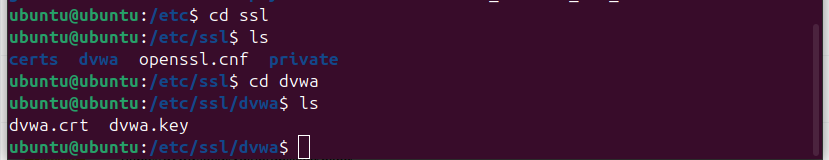


## 7️⃣ Installing and Configuring SafeLine WAF
SafeLine WAF is deployed as a reverse proxy to protect the DVWA application.

🔷 7.1 Automatic Deployment

Run the official install script on the Ubuntu server:

```bash
bash -c "$(curl -fsSLk https://waf.chaitin.com/release/latest/manager.sh)" -- --en
```
Follow the on-screen prompts to complete installation, you will be shown:

 ● Admin username & password

 ● WAF Management URL typically on port 9443
 
 
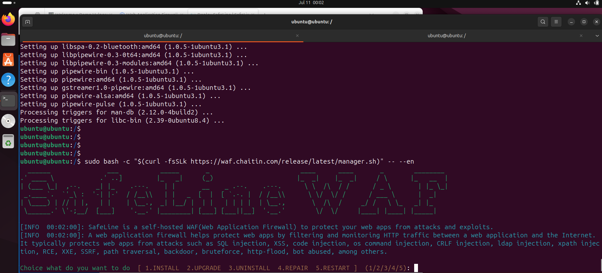


🔷 7.2 Importing the Self-Signed Certificate

Log in to the SafeLine WAF web interface and upload the SSL certificate you generated:

● Certificate File: /etc/ssl/dvwa/dvwa.crt

● Key File: /etc/ssl/dvwa/dvwa.key


## 8️⃣  Onboarding the DVWA Application

Use the SafeLine WAF management console to add a new application:

**DNS Name:** dvwa.local

**Backend URL (reverse proxy):** http://<UbuntuIP>:8080 

Delete port 80; only enable port 443

**Virtual Host:** dvwa.local

Attach the SSL Certificate (if you want the WAF to serve HTTPS).


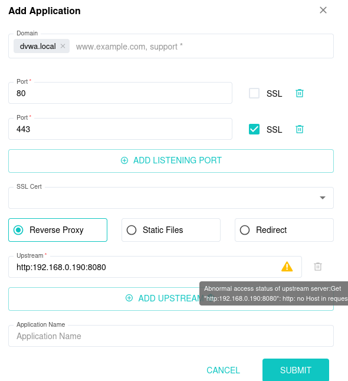


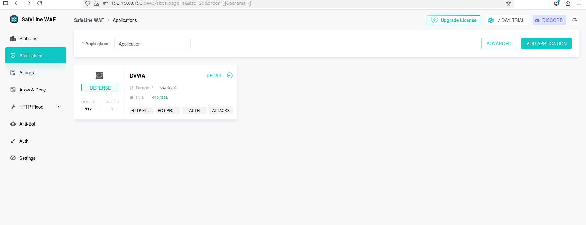


## 🧪 Attack Simulations & WAF Defense ##

This section documents the attacks performed using the DVWA web interface from the Kali Linux attacker VM, and how SafeLine WAF **detected, logged, and blocked** them.
The WAF security levels were adjusted to observe different blocking thresholds, and additional custom defenses were configured through the WAF GUI.

🔷 Attacks Performed via DVWA:

The following attacks were executed by navigating DVWA’s vulnerable modules and submitting crafted payloads:

| Attack Type                    | Payload / Method                         | WAF Action         |
| ------------------------------ | ---------------------------------------- | ------------------ |
| **SQL Injection**              | `' OR '1'='1`                            | ✅ Blocked & logged |
| **Cross-Site Scripting (XSS)** | `<script>alert(1)</script>`              | ✅ Blocked & logged |
| **Command Injection**          | `127.0.0.1; ls -la`                      | ✅ Blocked & logged |
| **File Upload (PHP Shell)**    | Uploaded `shell.php` disguised as `.jpg` | ✅ Blocked & logged |
| **HTTP Flood (DoS)**           | Excessive requests from Kali using DVWA  | ✅ Blocked & logged |


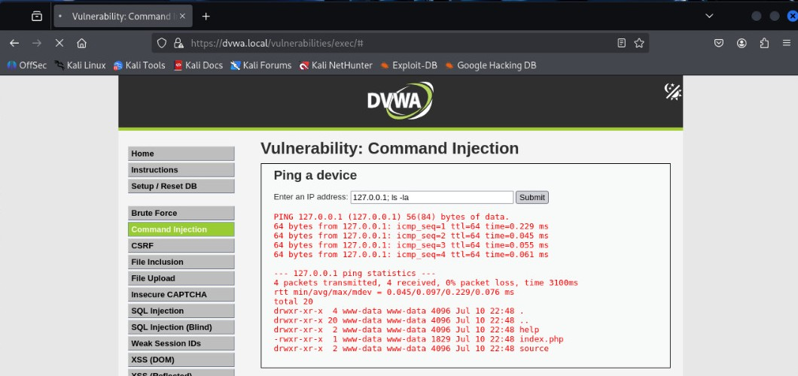


✅ After each attack, the WAF logs were reviewed to confirm detection and identify attacker details (source IP, timestamp, attack type).


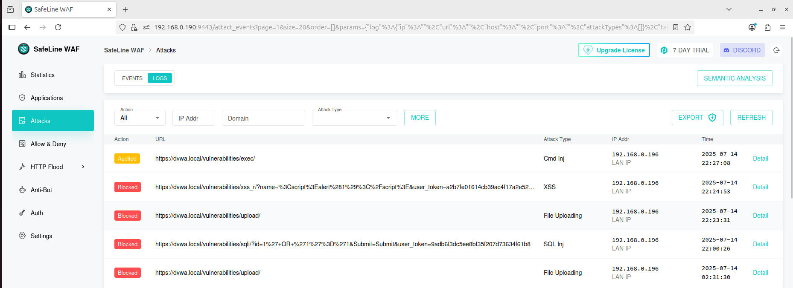


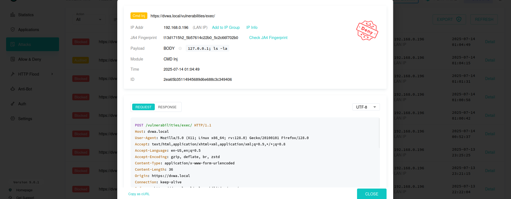

## 🔷 WAF Security Levels

The WAF’s security level was adjusted (Low → Medium → High) to observe how strictness impacted detection and blocking.
Higher levels resulted in more aggressive blocking of suspicious patterns.


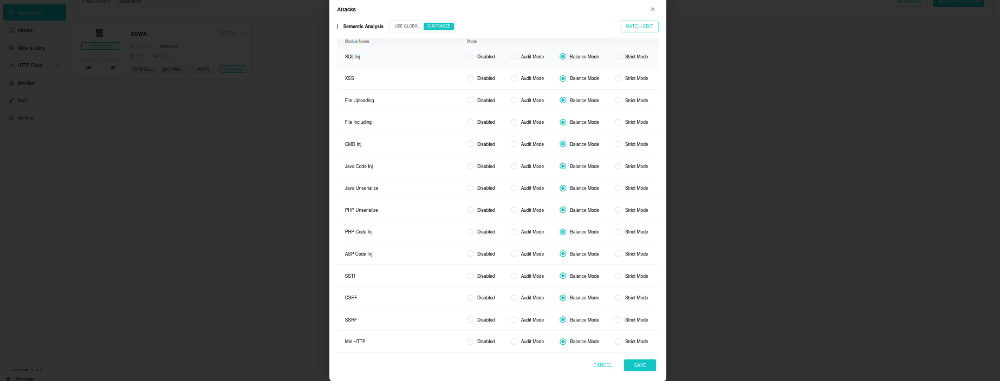


## 🔷 Additional WAF Protections

**✅ Authentication Gateway**

Enabled authentication on the DVWA endpoint to require login before accessing the app.
Verified that unauthenticated requests were blocked at the WAF.


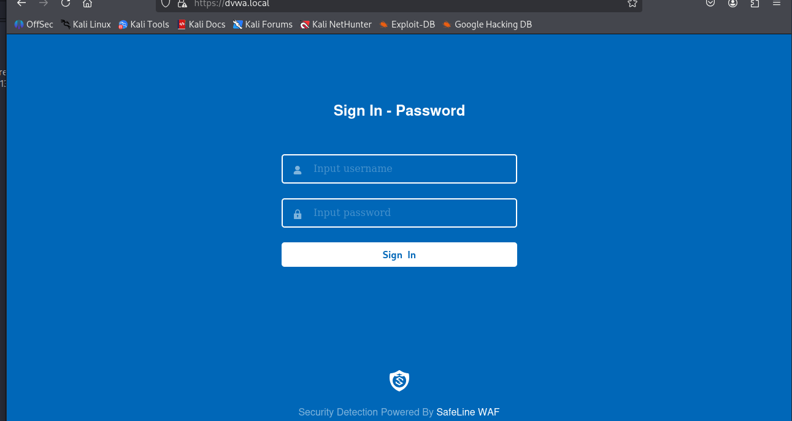


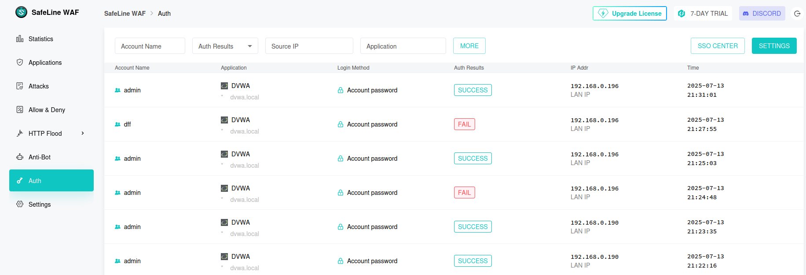


**✅ Custom Deny Rules**

Added a deny rule for the Kali VM IP (192.168.x.x) to completely block the attacker.


 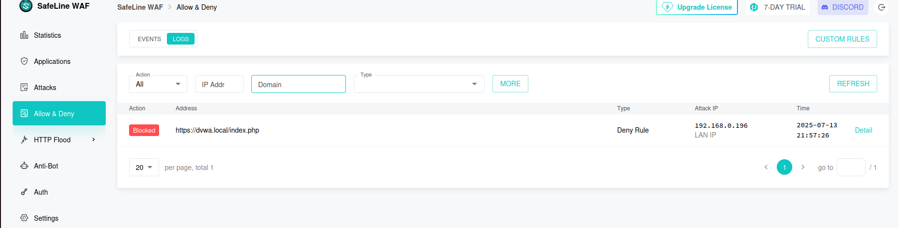
 

**✅ HTTP Flood Defense(DoS)**

Configured thresholds & penalties to mitigate DoS attacks.
Verified that excessive requests were detected and blocked.


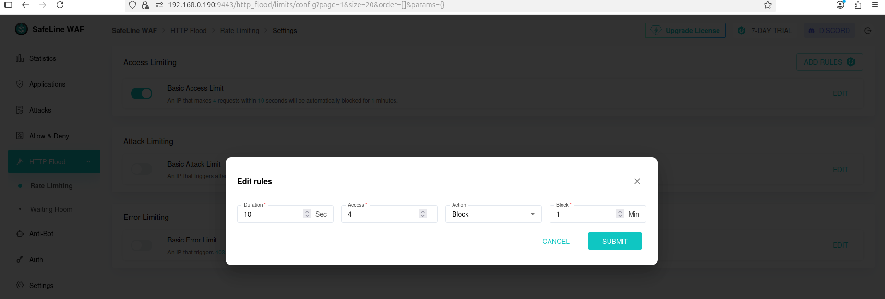


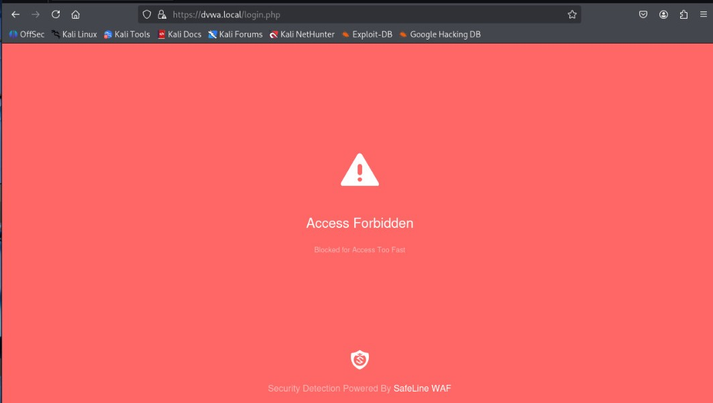


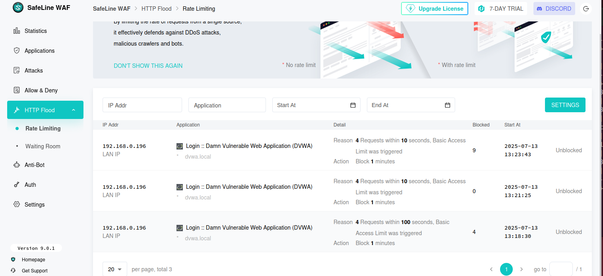


## 🚀 Conclusion

This project strengthened my technical skills in the following areas:

✅ LAMP Stack Administration

✅ Web Application Firewall Reverse Proxy & SSL/TLS Configuration

✅ Offensive Testing & Payload Crafting

✅ Defensive Rule Creation & Log Analysis

✅ Linux Networking & Virtualization

✅ Documentation & Security Reporting
